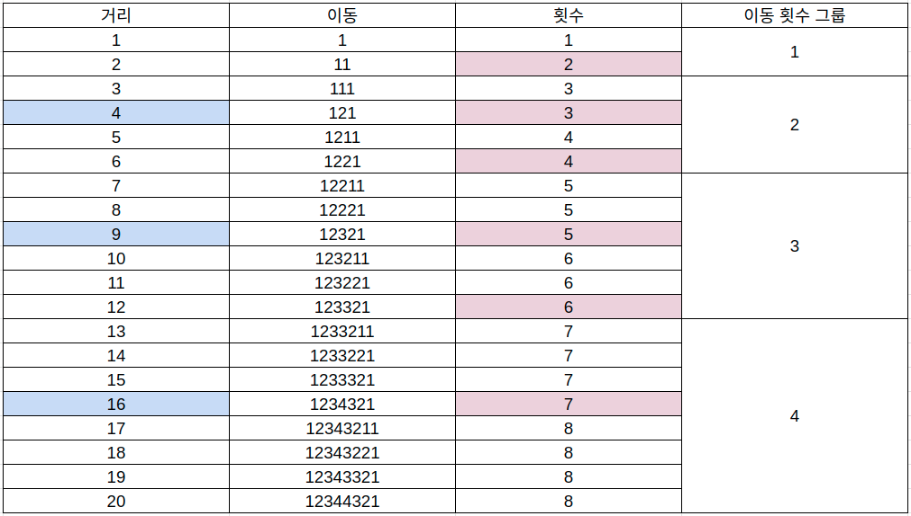

# 풀이

잘 안 풀릴때는 그려보거나 규칙성을 찾아보는게 도움이 되는 것 같다. 이 문제는 규칙성을 잘 파악하면 쉬운 문제였다.



위 그림을 보면 여러가지 규칙성을 찾을 수 있다.

1. 거리의 값이 $n^2$일 때 한 번에 이동할 수 있는 수가 늘어난다. 이를 파란색으로 나타냈다.
2. 값이 변하는 구간은 제곱수인 경우에는 $2*n-1$이되고 합성수인 경우에는 가장 가까운 $n^2$ 보다 크면 $\lfloor\sqrt{n}\rfloor ^ 2$, 작거나 같으면 $\lfloor\sqrt{n+1}\rfloor ^ 2 - 1$으로 나타났다.
3. 이동횟수는 일정한 간격으로 늘어났다. 1과 2번 각각 한 번, 3과 4는 각 2번 씩 출현했고 각 출현횟수를 이동 횟수 그룹으로 묶었다. 이 그룹의 범위는 $2n$만큼 나타났다. 이를 토대로 예상컨대 9와 10은 각 5번씩 출현할 것이므로 $2 * 5 = 10$만큼 그룹을 지을 것이다.

두 행성 `a`와 `b` 사이의 거리는 `dist = b - a`로 나타낼 수 있고 이 값의 제곱수의 내림 값을 `x`라하고 `x`와 `x + 1`의 제곱수 중 `dist`는 $dist - x^2$와 $(x + 1)^2 - dist$에서 차가 더 작은 쪽에 더 가깝다.

> $dist - x^2 < (x + 1)^2 - dist = 2dist < (x+1)^2 + x^2$

좌항이 더 작은, 즉 위 부등식이 참이면 작은쪽은 제곱수에 가깝고 그렇지 않으면 큰 쪽의 제곱수에 가깝다.

예컨대 12의 제곱근 $\sqrt{12}$의 값은 3과 4사이이다. 이 값을 내림하여 제곱하면 3이 된다. $3^2$과 $4^2$ 사이에서 12가 어느 값과 더 가까운지 판단하려면 $12 - 9 = 3$와 $16 - 12 = 4$중 차가 작은쪽에 더 가까운 것을 고르면 된다. 전자의 값이 더 작으므로 12는 9에 더 가깝다. 9에 가까우면서 9보다 크므로 이동 횟수는 $3^2 = 6$이 된다.

또 다른 예로 19는 $\sqrt{15} \approx 3$이고 9과 16중 16에 더 가깝다. 16보다 작거나 같으므로 $2*(3+1)-1 = 7$이 된다.

```js
const input = require('fs').readFileSync('/dev/stdin').toString().trim().split('\n');
let res = '';
input.slice(1).forEach(v => {
    const [a, b] = v.split(' ');
    res += calc(b - a) + '\n';
});

console.log(res);

function calc(dist) {
    const x = Math.floor(Math.sqrt(dist));
    const lte = x ** 2, gt = (x + 1) ** 2;

    if (x ** 2 === dist) return 2 * x - 1
    else return lte + gt > 2 * dist ? 2 * x : 2 * (x + 1) - 1;
}
```