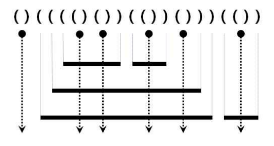

# 풀이

스택으로 풀 수 있는 문제. 근데 괄호가 두 개뿐이어서 스택으로 안 풀고 카운팅해서 풀어도 됨.



중요한 것은 닫힌 괄호를 만났을 때 레이저인지 파이프의 끝인지를 판단해야한다. 만약 이전 문자가 열린 괄호라면 레이저고 그렇지 않으면 파이프의 끝이다.

그림을 토대로 파이프의 관점에서 보았을 때 레이저는 파이프를 파이프 내부의`레이저 개수 + 1`만큼 잘라낸다.
반면 레이저의 관점으로 보면 레이저보다 앞에 있는 괄호 만큼 잘라낸다. 예를 들면 두 번째 레이저의 경우 레이저 앞에 열린괄호가 연속해서 3개가 있으므로 파이프를 3개 만큼 잘라낸다.

파이프의 끝인 경우 1만큼 더해주면 된다. 앞에서 잘렸든 안 잘렸든 상관이 없음.

## 스택 X

여기서는 레이저 `()`를 `-`로 바꾸어서 풀었으므로 이전 값이 무엇인지는 상관없고 현재 지점이 레이저인 경우와 괄호인 경우만 생각하면 된다.

```js
const data = require('fs').readFileSync('./data.in').toString().trim();
// 모든 레이저를 단일 문자로 치환
// 그러면 닫힌 괄호일 때 레이저인지 파이프의 끝인지 구분할 필요 없음.
const replaced = data.replaceAll('()', '-');
let left = 0, res = 0;

for (let d of replaced) {
    // 열린 괄호인 경우 카운터 증가
    if (d === '(') {
        left += 1;
    }
    // 닫힌 괄호인 경우 카운터 감소
    else if (d === ')') {
        left -= 1;
        // 파이프의 끝이므로 전체 파이프 개수 증가
        res += 1;
    }
    // 레이저인 경우 파이프의 개수만큼 잘라내므로 파이프 개수만큼 더해준다.
    else res += left;
}

console.log(res);
```