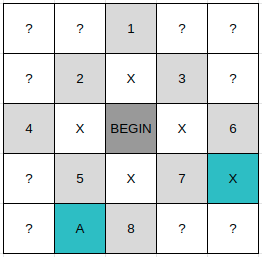

# 풀이

단순히 BFS 탐색 방향을 위, 왼쪽, 오른쪽, 아래 방향순으로 탐색하면 틀리게 된다. 아래 예제를 보자.



앞선 방향대로 탐색을 진행하면 큐에 들어있는 2번째 방문지들의 순서는 위 그림과 같이 된다. 실제로는 X를 선택해야하지만 A를 먼저 탐색하게 되므로 문제에서 원하는 바와 달라지게 된다.

```js
const [n, ...data] = require('fs').readFileSync('./data.in').toString().trim().split('\n');
const SIZE = +n;
const shark = {
    weight: 2,
    eaten: 0,
    moved: 0,
    coords: [0, 0]
};

const board = data.map((row, y) =>
    row.split(' ').map((v, x) => {
        const ret = +v;
        if (ret === 9) shark.coords = [x, y];
        return ret;
    })
);

const dir = [
    [0, -1],
    [-1, 0],
    [1, 0],
    [0, 1],
];

const isValidPosition = (x, y) => y >= 0 && x >= 0 && y < SIZE && x < SIZE;

const isEdible = (x, y) => board[y][x] > 0 && board[y][x] < shark.weight;

const canMove = (x, y) => board[y][x] <= shark.weight;

const bfs = (bx, by, prevMoved) => {
    const q = [[bx, by, prevMoved]];
    const isVisited = Array.from(Array(SIZE), () => Array(SIZE).fill(-1));
    const dist = [];
    isVisited[by][bx] = 0;
    board[by][bx] = 0;

    while (q.length) {
        const [x, y, moved] = q.shift();

        for (let [dx, dy] of dir) {
            const nx = x + dx, ny = y + dy;
            if (!isValidPosition(nx, ny) || isVisited[ny][nx] !== -1 || !canMove(nx, ny)) continue;
            isVisited[ny][nx] = isVisited[y][x] + 1;

            // 먹을 수 있는 물고기인 경우 따로 저장
            if (isEdible(nx, ny)) dist.push([nx, ny, moved + 1]);
            else q.push([nx, ny, moved + 1]);
        }
    }
    // 가장 위쪽이면서 왼쪽인 좌표 탐색
    dist.sort((a, b) => a[2] - b[2] || a[1] - b[1] || a[0] - b[0]);
    return dist[0];
}

let pos = bfs(shark.coords[0], shark.coords[1], 0);
// 한 번 while문을 돌때마다 1마리씩 먹는다.
while (pos) {
    // 다음에 시작할 BFS정보
    const [x, y, moved] = pos;
    // 먹은 물고기 자리는 0으로 바꾸어줌
    board[y][x] = 0;
    shark.eaten += 1;
    if (shark.weight === shark.eaten) {
        shark.weight += 1;
        shark.eaten = 0;
    }
    shark.moved += moved;
    pos = bfs(x, y, 0);
}
console.log(shark.moved);
```