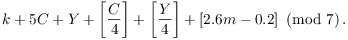

# 풀이

그레고리안 역법 이용, 알고리즘 없이 풀려면 `Date.getDay()`를 사용하자.



무슨 요일인지 구하는 식. 주의 할 것은 3월 이면 1로 판별하고 3월 이전일 경우 1년전으로 취급한다. 예컨대 1857년 9월 13일은 $k=13$, $m=7$, $C=18$, $Y=57$이 되며 1954년 1월 3일은 $k=1$, $m=11$, $C=19$, $Y=53$이 된다.

```js
const [m, d] = require('fs').readFileSync('/dev/stdin').toString().split(' ').map(Number);
const mm = [11, 12, 1, 2, 3, 4, 5, 6, 7, 8, 9, 10], week = ['SUN', 'MON', 'TUE', 'WED', 'THU', 'FRI', 'SAT'];
const idx = d + 106 + (m >= 3 ? 7 : 6) + Math.floor(2.6 * mm[m-1] - 0.2);
console.log(week[idx % 7]);
```

## 참조

- Bruce Ikenaga, "Calendar Algorithms", https://sites.millersville.edu/bikenaga/number-theory/calendar/calendar.html