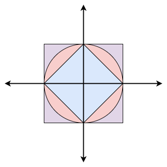

# 풀이



> 맨해튼 거리의 원은 중심 점에서 반지름 이라고 불리는 일정한 거리만큼 떨어져 있는 점들의 집합이다. 유클리드 기하학과 맨해튼 거리의 원은 모양이 다르다. 맨해튼 거리에서 원은 좌표의 축으로 45° 기울어진 정사각형이다. 모눈의 크기가 줄어들면 수많은 점들은 연속적인 정사각형의 모양을 만드는데, 유클리드 거리를 이용한 각 변이 길이가 √2r이면 이 원의 반지름은 r이다. 각 변의 길이를 맨해튼 거리로 측정한 값은 2r이 된다.

그림에서 빨간색 원은 유클리드 기하학에서의 반지름이 $r$인 원의 넓이, 파란색이 맨하탄 거리로 나타낸 반지름이 $r$인 원의 넓이이다.

```js
const r = +require('fs').readFileSync('/dev/stdin').toString();
console.log((Math.PI * r * r).toFixed(6));
console.log((2 * r * r).toFixed(6));
```

## 참조(Reference)

- "맨해튼 거리", *Wikipedia*, https://ko.wikipedia.org/wiki/%EB%A7%A8%ED%95%B4%ED%8A%BC_%EA%B1%B0%EB%A6%AC.