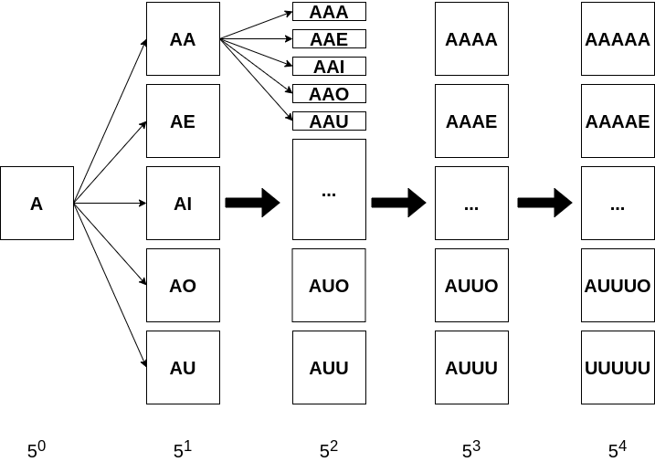
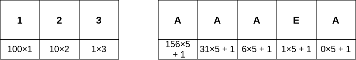

# 풀이

쉽게 생각하면 쉽게 풀리는 문제고 어렵게 생각하면 어렵게 풀리는 문제같다. 처음에는 각 5진법과 관련이 있을거라 생각하고 규칙을 찾는데에 힘썼는데 잘 찾지 못해서 먼저 문제를 풀어내는 것에 집중했다.

## 첫 번째 풀이

```js
function solution(word) {
    const vowels = 'AEIOU';
    let set = new Set([...vowels]);

    for (let i = 0; i < 4; i += 1) {
        const temp = new Set(set);
        for (let vowel of vowels) {
            set.forEach(s => temp.add(s + vowel));
        }
        set = temp;
    }

    return Array.from(set).sort().findIndex(v => word === v) + 1;
}
```

`A, E, I, O, U`에 다시 각 알파벳을 이어 붙이는 것을 반복하여 가능한 조합을 찾고 이를 정렬하여 해당 알파벳 조합이 위치하는 `인덱스 + 1`을 반환했다.

## 두 번째 풀이

뭔가 규칙이 있을것만 같은데 이를 찾아내는 것이 힘들었다. 다른 사람들의 풀이를 참고해서 정리한다. 다음과 같은 사진을 보자.



`A`로 시작하는 단어의 개수는 모두 $5^0 + 5^1 + ... + 5^4 = 781$개이다. 그 다음은 문제에서 주어진 규칙에 따라 `E`로 시작하므로 `E`로 시작하는 단어는 782번째부터 시작할 것이라는 것을 알 수 있다. 따라서 시작 알파벳간의 간격은 781이므로 같은 방식을 통해 `I`, `O`, `U`가 시작하는 인덱스 값을 알 수 있다.

| 알파벳 | 시작 인덱스 |
|:-------:|:----------:|
| A      | 1           |
| E      | 782         |
| I      | 1563        |
| O      | 2344        |
| U      | 3125        |

위에서 구한 맨 마지막 글자(가장 좌측 글자)가 변하는 인덱스를 통해 각 자리의 알파벳들이 변하는 자릿수를 알 수 있다.

- `____A` $= 1$
- `AAAA_` $= 4$, `AAAAA` $= 5$
- `AAAAU` $= 9$, `AAAE_` $= 10$, `AAAEA` $= 11$
- `AAAE_` $= 10$, `AAAI_` $= 16$

즉 첫 번째(가장 우측) 알파벳은 1만큼 차이가 나고 두 번째 알파벳은 6만큼씩 차이가난다. 그런데 `AAAAU` 다음은 `AAAE_`로 처럼 자릿수가 변할 때마다 빈 공백이 존재한다. 따라서 정확히 n진법도 아니기 때문에 $×5 + 1$만큼 자릿수가 차이가 나게 된다. 그렇다면 `A`가 단순 $1$이 아니기 때문에 `A`는 $0 × 5 + 1$로 볼 수 있고 다른 알파벳도 이를 기반으로 $A = 0, E = 1, ..., U = 4$라는 것을 알 수 있다.



10진수 `123`과 문제의 `AAAAE`를 비교한 그림이다. 이외에 예를들면 다음과 같다. 

- `AAAAA` $= 5$, `AAAAE` $= 6$
- `AAAAA` $= 5$, `AAAEA` $= 11$
- `AAAE_` $= 10$, `AAAI_` $= 16$
- `AAEAA` $= 36$, `AAIAA` $= 67$
- `A____` $= 1$, `E____` $= 782$

각 자릿수는 이전 자릿수$(×5) + 1$만큼 차이가 나는 것을 알 수 있다. 이를 통해 표를 작성하면 다음과 같다.

| 알파벳 위치 | 시작 인덱스 |
|:-----------:|:-----------:|
| `____X`       | 1           |
| `___X_`       | 6           |
| `__X__`       | 31          |
| `_X___`       | 156         |
| `X____`       | 781         |

이제 각 알파벳을 수로 바꿔야하는데 `A`는 1부터 시작하고 `E`는 782부터 시작하는 것을 알고있고 자릿수가 변하려면 $(×5) + 1$만큼 차이가 나는 것도 알고 있다. 각 위치 인덱스를 배열로 만들고 `[781, 156, 31, 6, 1]` 이 배열에 해당하는 알파벳 숫자 값을 넣어주면 된다.

- `AAAE_` $ = (0 × 781 + 1) + (0 × 156 + 1) + (0 × 31 + 1) + (1 × 6 + 1) = 10$
- `AAAEA` $ = (0 × 781 + 1) + (0 × 156 + 1) + (0 × 31 + 1) + (1 × 6 + 1) + (0 × 1 + 1)= 11$
- `AEIOU` $ = (0 × 781 + 1) + (1 × 156 + 1) + (2 × 31 + 1) + (3 × 6 + 1) + (4 × 1 + 1) = 245$

최종적인 코드는 다음과 같다.

```js
function solution(word) {
    return word.split('').reduce((acc, cur, i) => acc + [781, 156, 31, 6, 1][i] * ['A', 'E', 'I', 'O', 'U'].indexOf(cur) + 1, 0);
}
```
